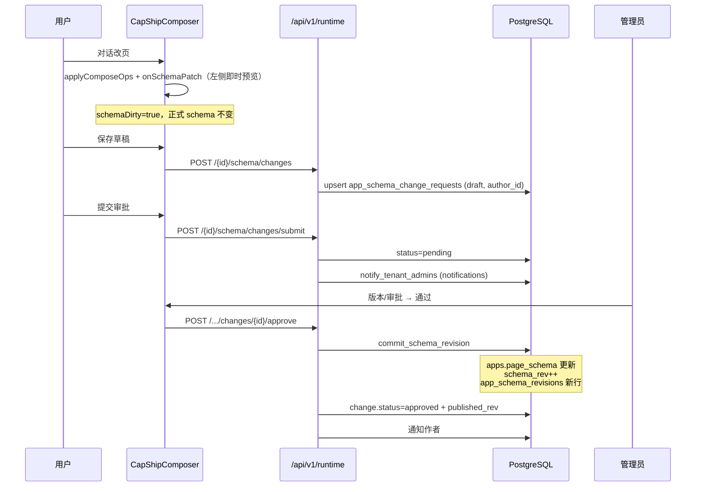

# CapShip 改页审批流（草稿 → 审批 → 正式）

## 核心原则

1. **本地预览 ≠ 正式业务**：对话改页可立刻改左侧预览，但**不**自动写 `apps.page_schema`。
2. **草稿绑个人账号**：`POST .../schema/changes` 写入 `app_schema_change_requests`，`author_id` = 当前用户。
3. **管理员通过后才影响正式 Runtime**：`approve` → `commit_schema_revision` → 升 `schema_rev` + `app_schema_revisions`。
4. **不是 Git main**：影响的是应用运行时页面配置与业务菜单，不是仓库代码分支。
5. **预览包**（`preview-*` / `meta.preview`）走本地 localStorage 版本，无审批。

## 状态机

```text
[对话改页] → 本地未保存 (schemaDirty, 仅前端)
     ↓ 保存草稿
  draft  (DB, 绑 author_id) ──取消→ cancelled
     ↓ 提交审批
  pending ──通知租户管理员──┐
     ↓ 通过                 ↓ 驳回
  approved                 rejected
     ↓                     ↓ 可再编辑回 draft
  正式 page_schema
  + schema_rev++
  + app_schema_revisions 快照
```

| status | 含义 | 是否影响正式 Runtime |
|--------|------|----------------------|
| （仅前端 dirty） | 本机会话预览 | 否 |
| `draft` | 账号草稿 | 否 |
| `pending` | 待管理员审批 | 否 |
| `approved` | 已通过并发布 | **是**（已写入） |
| `rejected` | 已驳回 | 否 |
| `cancelled` | 已取消 | 否 |

## 数据流（端到端）



## API 契约

前缀：`/api/v1/runtime/{public_id}`

| 方法 | 路径 | 谁 | 作用 |
|------|------|----|------|
| GET | `/schema` | 公开可读 | **正式** page_schema + schema_rev |
| POST | `/schema/changes` | 登录同租户 | 保存/更新个人 draft |
| POST | `/schema/changes/submit` | 作者 | draft→pending + 通知管理员 |
| GET | `/schema/changes` | 登录 | 列表；`is_admin`；非管理员见自己的 + pending |
| POST | `/schema/changes/{id}/approve` | **admin** | 写入正式 schema + 版本历史 |
| POST | `/schema/changes/{id}/reject` | **admin** | 驳回 |
| POST | `/schema/changes/{id}/cancel` | 作者/admin | 取消 |
| PATCH | `/schema` | **仅 admin** | 直接发布（跳过审批） |
| GET | `/schema/revisions` | 登录 | 正式版本历史 |
| POST | `/schema/restore` | **仅 admin** | 回滚正式版（产生新 rev） |

### 关键表

- `apps.page_schema` / `schema_rev` / `schema_editor_name` — **正式**唯一真相
- `app_schema_revisions` — 每次正式写回的快照（含 `source=approve`）
- `app_schema_change_requests` — 草稿与审批单（Alembic `038`）
- `notifications` — 提交时 `notify_tenant_admins`；通过/驳回通知作者

## 前端落点

- UI：`packages/capship-composer/src/CapShipComposer.tsx`
  - **保存草稿** → `upsertSchemaChangeDraft`
  - **提交审批** → `submitSchemaChange`
  - **通过/驳回**（管理员）→ `approveSchemaChange` / `rejectSchemaChange`
  - **直接发布**（管理员）→ `patchRuntimeSchema` + `directPublish`
  - **版本/审批** 列表：变更单 + 正式 `revisions` 合在一起
- API 客户端：`packages/capship-composer/src/api.ts`
- 预览页：`preview-*` 仍用 `localSchemaRevisions`（无审批）

## 实现/改动时检查清单

1. 非管理员 **禁止** 静默 `PATCH /schema` 写正式库（应 403 `SCHEMA_APPROVAL_REQUIRED`）
2. `approve` 必须走 `commit_schema_revision`（乐观锁 `base_rev`；冲突可 `force`）
3. 提交审批必须通知管理员（`schema_change` 类型通知）
4. Runtime 读路径：
   - **正式全员**：`apps.page_schema`（`schema_view=formal`）
   - **作者单侧**：登录作者若有 `draft`/`pending`，`GET /schema`（带 Bearer）返回个人草稿（`schema_view=personal_draft`）；他人/匿名仍见正式
   - `?view=formal` 可强制正式版
5. 迁移：`038_app_schema_change_requests.py`；部署后 `alembic upgrade head`
6. 禁止用假列表冒充「已全员生效」；未通过 = 他人正式菜单不变；作者单侧可见草稿是预期

## 与选型即交付的关系

- 审批通过后的正式 schema 仍须挂 **web_ready** 真能力；`gen_*` 预览页不能冒充已交付业务 API。
- 业务工单数据仍走各 capability 真 API；本流程只管 **页面/菜单配置** 的发布门禁。

## 相关文件

| 层 | 路径 |
|----|------|
| 模型 | `backend/app/db/models.py` → `AppSchemaChangeRequest` |
| 服务 | `backend/app/services/schema_change_approval.py` |
| 版本写回 | `backend/app/services/schema_versioning.py` |
| API | `backend/app/api/v1/runtime.py` |
| 迁移 | `backend/alembic/versions/038_app_schema_change_requests.py` |
| Composer | `packages/capship-composer/src/CapShipComposer.tsx` |
| 能力契约 | `.cursor/skills/capship-capability/SKILL.md` |
