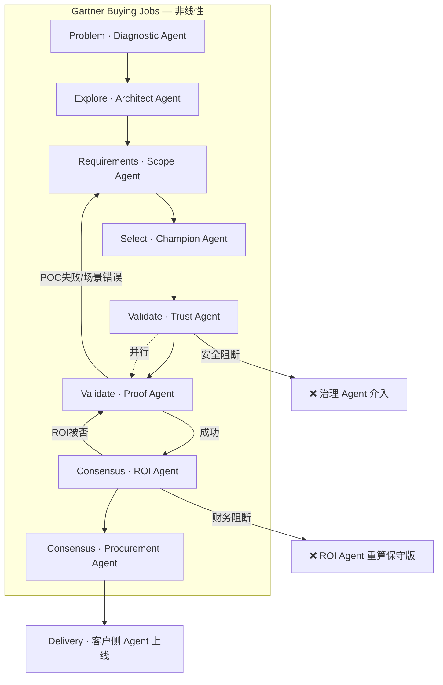

# B端采购四重误判 · AI 智能体品类深拆 + 「全流程 Agent 化」体验设计

> 接续《真实案例版》。目标：**不说「千人千面」谎话**，却让 Buying Committee 每个人**第一眼就感到**——  
> 「这家卖 Agent 的，连卖给自己的过程都是 Agent 在跑。」

---

## 一、四条 critique 在「AI 智能体」品类下为什么要更严重

### 1. 线性 13 步 vs 六 Buying Jobs 非线性 —— Agent 单多一层「治理回环」

| 维度 | 普通 SaaS | AI 智能体平台 | 对官网/产品的含义 |
|------|-----------|---------------|------------------|
| 失败回退 | 换功能模块 | **换「自主程度」**（全自动→人工确认→仅建议） | 流程图必须画 ** autonomy 降级分支** |
| 并行审查 | 安全 + 法务 | 安全 + 法务 + **模型治理** + **工具权限** | Trust 页要单独讲 Agent 权限模型 |
| POC 周期 | 7–14 天 | 常 **4–8 周**（要测异常、边界、人工采纳率） | 不能把 POC 画成「试用按钮」 |
| 典型回退 | 需求变更 | **第一次 POC 场景选错**（如冷启动外呼）→ 回 S3 重定场景 | 案例要写「失败→换场景→成功」 |

**Agent 品类专属的 3 条回环（必须出现在流程图里）：**

```
回环 A：POC 失败 → 降低自主级别 → 重定场景（S6 → S3）
回环 B：IT 安全预审 ↔ POC 环境申请（S5 ↔ S6 并行，任一否决不进入全量）
回环 C：财务否 ROI → Champion 用「已验证指标」重算 → 再报立项（S7 → S3/S6 数据）
```

**直观感知设计：** 官网首页不用漏斗图，用 **「Agent 编排图」**——7 个 Agent 节点 + 虚线回环箭头，标注「POC 未过 → Requirements Agent 重开」。  
访客 3 秒内读懂：**非线性 = Agent 会重规划**，不是销售踢皮球。

---

### 2. 「AI 识别岗位 → 千人千面」—— Agent 品类里更讽刺

**讽刺点：** 你卖的是「企业级 Agent 平台」，官网却用一个 **猜不准岗位的 Chatbot** 假装懂客户——IT 一眼识破，信任反向扣分。

| 谎言版 | 真实 Committee 行为 | Agent 原生替代（可落地） |
|--------|---------------------|-------------------------|
| 识别访客是 CFO | CFO **从不自己逛官网**，Champion 转发材料 | **Business Case Agent** 生成 1 页 ROI，Champion 微信转发 |
| 首页换皮 | 6–10 人看 **21–35 份不同资产** | **同一 Deal Room，不同 Specialist Agent** |
| 实时生成页面 | 企业要求 **口径一致、可审计** | Agent **从 SSOT 内容库 RAG 组装**，带来源引用 |
| @同事协同浏览 | 真实协同在 **企微/钉钉 + PDF** | Agent 生成 **Share Link**，同事打开即进 **对应 Agent** |

**关键概念替换：**

- ❌ 千人千面（Who you are）
- ✅ **千任务千 Agent**（What job you need to finish now）

Gartner 六 Jobs 在 Agent 语言下的映射：

| Buying Job | 客户要完成的「任务」 | 对应 Specialist Agent | 官网第一眼 |
|------------|---------------------|----------------------|-----------|
| Problem Identification | 「这问题算不算 urgent？」 | **Diagnostic Agent** | 输入痛点 → 输出诊断报告 PDF |
| Solution Exploration | 「Build / Buy / Agent 平台怎么选？」 | **Architect Agent** | 架构图 + 集成清单（可调 intent_agent） |
| Requirements Building | 「POC 测哪 3 个场景？」 | **Scope Agent** | 对话生成 POC Scope 文档 |
| Supplier Selection | 「帮我在内部推销这家」 | **Champion Agent** | 打包案例+对比+ES 一页纸 |
| Validation | 「会不会乱说话/乱调 API？」 | **Trust Agent** + **Proof Agent** | 安全问答 + POC 向导 |
| Consensus Creation | 「财务/采购能不能过？」 | **ROI Agent** + **Procurement Agent** | TCO 表 + 招标资质包 |

**直观感知设计：** 官网顶栏不是「产品/定价/关于」，而是 **「选你的任务 >>」** 六个入口，每个入口进 **不同 Agent 工作台**（同一套 Floating Dock / Chevron UI，不同 system prompt + 工具集）。

---

### 3. 「自助体验建立信任」—— Agent 品类的信任公式不同

**普通 SaaS 信任：** 功能截图 + 案例 Logo  
**Agent 平台信任：** 必须证明 **「可控的自主性」**

| 信任维度 | SaaS 要什么 | Agent 额外要什么 | 官网/产品呈现 |
|----------|------------|-----------------|----------------|
| 能力 | Feature list | **Tool call 轨迹**、失败降级 | 录屏：Agent 调 CRM 失败 → 转人工 |
| 安全 | SOC2/等保 | **Prompt 注入防护**、权限边界 | Trust Agent 可问「客户数据是否进训练」 |
| 效果 | NPS | **人工采纳率**、**幻觉率** | POC 报告模板里写清指标 |
| 合规 | DPA | **自主行动审计日志** | 可下载样例 audit log（脱敏） |

**所以：** 不是「逛官网建立信任」，是 **「让 Agent 交付可验证工件建立信任」**。

每个阶段 Agent 交付的 **工件（Artifact）** 才是信任载体：

| 阶段 | Agent 交付物 | 为何比浏览有效 |
|------|-------------|---------------|
| S1 | 《问题诊断 1-pager》 | 有结构、可转发 |
| S3 | 《POC Scope 签字版》 | 成为合同附件 |
| S5 | 《安全问卷 80% 预填》 | IT 省 2 周 |
| S6 | 《POC 验收报告》 | 财务认数字 |
| S7 | 《ROI 保守版 + 假设清单》 | 过立项 |

**直观感知设计：** 每个 Agent 对话窗口右侧固定 **「工件栏 Artifact Panel」**——像 IDE 一样，聊的同时生成 PDF/Excel/架构图。  
用户感受：**不是聊天，是 Agent 在干活。**

---

### 4. 卡单位置 —— AI 智能体把两道关放大成四道关

Starr Conspiracy 数据（HR Tech，可类推 Enterprise AI）：

| 卡点 | 占比 | 在 Agent 采购中的真实台词 | 谁否决 |
|------|------|--------------------------|--------|
| 业务 Case / ROI | **61%** | 「AI 提效 30% 从哪来的？POC 只验证了首响，没验证赢单率」 | 财务 |
| 安全 / DPA | **44%** | 「Agent 能调哪些 API？删数据 30 天能否证明？模型是否出境？」 | IT |
| **自主性恐惧**（Agent 特有） | ~35%* | 「销售怕 AI 乱承诺；法务怕 AI 乱发合同条款」 | 使用方+法务 |
| **POC→付费断层**（Agent 特有） | **63%** | 「PoC 好看，但没人接 Production 运维」 | Champion 失势 |

\* 自主性恐惧来自 AgentScout Enterprise AI Playbook，与财务/安全卡点可叠加。

**结论：** 演示（Supplier Selection）**不是主战场**；主战场是：

1. **ROI Agent** 帮 Champion 过财务（只引用 POC 已验证指标）
2. **Trust Agent** 帮 IT 过问卷（RAG + 引用条款原文）
3. **Governance Agent**（新品类必需）讲清 **人工确认节点 + 权限白名单**
4. **Production Agent**（Pilot-to-Production 函）锁预算与验收

**直观感知设计：** 官网「客户旅程」区不用 13 步，用 **「四座山」可视化**——演示只是小山，ROI/安全/治理/上线才是四座大山；每个山顶一个 Agent 图标。

---

## 二、核心主张：「采购即 Demo」—— 卖 Agent 的全流程本身由 Agent 编排

> **BlockHub 对外只讲一件事：**  
> 你采购我们平台的过程 = 你将来在平台上编排 Agent 的缩影。  
> committee 每个人不是在「看官网」，是在 **跟不同 Specialist Agent 协作完成 Buying Job**。

### 2.1 七 Agent 编排（对应真实采购 + 可演示产品能力）

```
                    ┌─────────────────┐
                    │ Orchestrator    │
                    │ Deal Room Agent │ ← 记住 deal_id、阶段、committee
                    └────────┬────────┘
         ┌──────────┼──────────┼──────────┐
         ▼          ▼          ▼          ▼
   Diagnostic   Architect    Scope      Champion
     Agent        Agent      Agent       Agent
   (S1 问题)    (S2 探索)   (S3 需求)   (S4 短list)
         │          │          │          │
         └──────────┼──────────┼──────────┘
                    ▼
              Trust Agent ←──→ Proof Agent
               (S5 安全)      (S6 POC)
                    │
         ┌──────────┴──────────┐
         ▼                     ▼
    ROI Agent          Procurement Agent
     (S7 立项)            (S8 合同)
```

**与现有代码对齐（可快速落地）：**

| Agent | 现有能力 | 需补工具 |
|-------|---------|---------|
| Diagnostic / Architect | `intent_agent` + catalog | 输出 PDF、集成清单模板 |
| Scope | `module_suggest` | POC checklist 生成 |
| Trust | 新建 RAG on Trust docs | 问卷预填 export |
| Proof | voice/demo 已有 | POC 指标追踪表单 |
| Champion | Share link 静态包 | 一键打包 + 追踪打开 |
| ROI | 无 | Excel 模板 + Agent 填假设 |
| Orchestrator | `voice_orchestrator` 雏形 | deal state machine |

---

## 三、让人「第一眼觉得全流程是 Agent」—— 五层感知设计

### 层 1：视觉语法（0–3 秒）

| 元素 | 做法 | 避免 |
|------|------|------|
| 首页 Hero | **实时 Agent 编排动画**：chevron `>>` 在 7 节点间传递「Deal 包」 | 静态 Banner /  stock 图 |
| 全局品牌 | 所有 CTA 统一 **`>> Agent名`**，如 `>> Scope Agent 生成 POC 清单` | 「立即咨询」「了解更多」 |
| 导航 | **Buying Jobs 六入口**，不用 Product/Pricing 传统结构 | 纯 SaaS 导航 |
| 状态条 | 页顶细条：「当前：Architect Agent · 正在生成集成方案…」 | 无状态 |

### 层 2：交互语法（3–30 秒）

- **Floating Dock 不是客服**：文案改为 **「Deal 进行到哪个 Job？输入你的任务 >>」**
- **每次提交需求** → 先过 `intent_agent` → 界面展示 **Agent 思考条**（IntentAnalysisStrip 已有）→ **工件栏弹出**
- **禁止空聊天**：Agent 每轮必须产出 **可下载/可转发** 的东西，否则只给 `guidance` 追问

### 层 3：Committee 语法（Champion 转发场景）

**Share Link 结构：** `blockhub.com/deal/{token}`

| 打开者 | URL 相同，Orchestrator 路由到 | 首屏差异 |
|--------|------------------------------|---------|
| 销售运营（Champion） | Champion + Scope Agent | POC 进度、内部话术 |
| IT | Trust Agent | 安全问卷、架构、audit 样例 |
| 财务 | ROI Agent | TCO 保守版、假设 editable |
| 采购 | Procurement Agent | SLA、资质、合同摘要 |

**同 Deal、同上下文、不同 Agent** —— 这是 **诚实版「千人千面」**，且 **直观展示平台 Multi-Agent 能力**。

### 层 4：失败与回环可见（建立专业信任）

官网 **必须公开展示**（不是隐藏）：

- POC 失败案例：「全自动外呼为何被否 → 改为 Human-in-the-loop」
- Agent 降级路径图：L3 全自动 → L2 建议 → L1 仅检索
- 安全 Agent 答不出来的题 → **转人工 + 24h 书面回复**（展示边界）

**感受：** 真 Agent 平台敢谈失败和边界；脚本 Demo 不敢。

### 层 5：工件即营销（30 秒–30 天）

每个 Agent 产出带 **BlockHub 水印 + deal_id** 的 PDF/Excel，committee 内部流转时 **自带品牌与能力证明**。

示例工件清单：

1. 《制造·线索首响·问题诊断》— Diagnostic Agent  
2. 《用友 CRM 集成架构说明》— Architect Agent  
3. 《POC Scope v2（人工确认版）》— Scope Agent  
4. 《安全问卷预填 42/50》— Trust Agent  
5. 《POC 验收报告·200 条线索》— Proof Agent  
6. 《ROI 保守版·仅已验证指标》— ROI Agent  

---

## 四、非线性流程图（Agent 原生版 · 可替换原 Visio）



**与原 13 步的本质区别：**

- 节点是 **Agent + Job**，不是销售动作  
- 虚线 = **Agent 重规划**（产品能力展示）  
- 阻断 = **真实卡单**，每道卡单对应一个 Specialist Agent  

---

## 五、对照表：原话术 → Agent 原生话术（对外统一口径）

| 原 Visio / 销售话术 | 问题 | Agent 原生话术 |
|--------------------|------|----------------|
| AI 导购识别岗位 | 猜不准 | **「告诉 Agent 你要完成什么任务」** |
| 千人千面内容 | 首页换皮 | **「同一 Deal，不同 Agent 协作」** |
| 自助体验 | 无工件 | **「3 分钟让 Agent 生成可转发报告」** |
| 预约演示 | 被动 | **「Proof Agent 带你做 15 分钟场景诊断」** |
| @同事 | 假功能 | **「生成 Committee Link，IT/财务各见各的 Agent」** |
| 建立信任 | 空洞 | **「Trust Agent 引用原文答安全题，带页码」** |

---

## 六、实施路线（让「全流程 Agent 感」逐步可感知）

| 阶段 | 交付 | 用户感知 |
|------|------|---------|
| **W1–2** | 首页 Hero 改为 Agent 编排动画 + 六 Job 入口 | 「这家公司卖 Agent 编排」 |
| **W2–3** | intent_agent 输出 + Artifact Panel（PDF 下载） | 「Agent 在产出文件」 |
| **W3–4** | Trust Agent（RAG 安全文档 20 页） | 「IT 问题能当场答」 |
| **W4–5** | Share Link `/deal/{token}` + 角色路由 | 「committee 各用各 Agent」 |
| **W5–6** | POC Scope + ROI 模板 Agent | 「卡单点有 Agent 帮过」 |
| **持续** | 每个成交案例沉淀为 Agent 可引用 Case | 「越卖越强」 |

---

## 七、一句话给所有人（内部对齐用）

**「我们不是用 AI 做官网噱头，我们把 B2B 采购本身做成 BlockHub 的第一个 Multi-Agent 应用——客户买的不仅是平台，更是他们刚刚亲身经历过的那条 Agent 编排链路。」**

---

*关联文档：`B端AI智能体订单闭环-真实案例版.md` · 现有 `intent_agent` / `FloatingAgentDock` / `IntentAnalysisStrip`*
