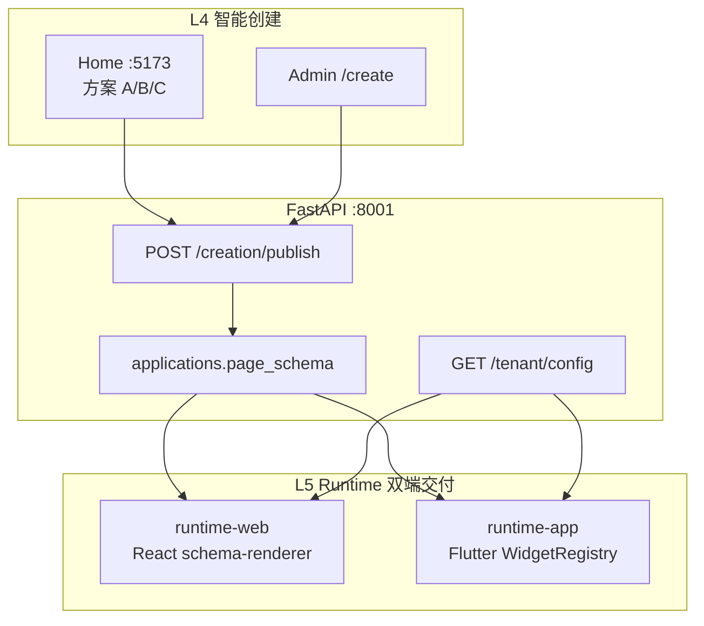

# TrackChat Flutter App 运行时与开源生态清单

> 生产目标：L4 智能创建同时交付 **Web 员工端 + Flutter App**，两端读取同一份 `page_schema` JSON。  
> 参考：`功能/14-TrackChat-技术架构选型.html`、`功能/11-TrackChat-定制化方案选择.html`、`功能/12-方案1-租户配置中心-前后端实现.html`

---

## 1. 在整体架构中的位置



| 交付物 | 技术 | 访问方式 | 阶段 |
|--------|------|----------|------|
| Web 员工端 | React + schema-renderer | `https://r.xxx.com/{appId}` | Phase 1（MVP 可先 H5） |
| **Flutter App** | Flutter 3.x + Dart | 内测包 / 应用商店 / 企业 MDM | **Phase 2 并行，生产必含** |
| 管理端 | React Admin | `admin.xxx.com` | 已有 |

**拍板原则（与业务文档一致）：**

- Web 与 Flutter **同 Schema、同 API**，后端不因 App 单独改契约
- 通信：**REST + SSE**（对话流式）；WebSocket 为二期实时通知增强项
- 不用 React Native；Flutter 负责 iOS / Android / 可选 Desktop

> **说明：** TrackChat 自己的 `runtime-app/` 尚未搭建，暂时没有「TrackChat 官方 Flutter Demo」。下面链接是 **候选 UI 库 / 能力组件** 的在线预览，用来直观感受 App 会长什么样。

---

## 1.1 在线预览链接（浏览器 / 手机可直接看）

### 优先推荐（与 TrackChat B 端 + 腾讯云最贴近）

| 看什么 | 链接 | 打开方式 |
|--------|------|----------|
| **TDesign Flutter 组件文档**（腾讯设计体系） | https://tdesign.tencent.com/flutter/overview | 浏览器，左侧点各组件 |
| **TDesign 预览 APK**（真机最直观） | https://oteam-tdesign-1258344706.cos.ap-guangzhou.tencentcos.cn/flutter/tdesign-flutter-0.2.7-314.apk | Android 下载安装 |
| **Bruno 在线演示**（阿里 B 端组件） | https://bruno.ke.com/page/demo | 浏览器 / 扫码 |
| **Bruno 全部组件列表** | https://bruno.ke.com/page/widgets | 浏览器看图 |
| **Bruno Demo APK** | https://github.com/LianjiaTech/bruno/releases | Releases 里下 apk |

### 浏览器里就能交互的 Web Demo

| 看什么 | 链接 |
|--------|------|
| **fl_chart 图表演示**（数据看板 Capability） | https://app.flchart.dev/ |
| **Syncfusion Flutter 组件画廊**（图表/表格等，偏企业） | https://flutter.syncfusion.com/ |
| **shadcn_flutter 组件目录**（84+ 现代 UI） | https://sunarya-thito.github.io/shadcn_flutter/ |
| **Forui 文档 + 组件预览** | https://forui.dev/docs |
| **GetWidget 组件文档**（1000+ 预制件） | https://docs.getwidget.dev/ |
| **Flutter 官方 Widget 图鉴** | https://docs.flutter.dev/ui/widgets |

### 应用商店 Sample App（装到手机上看）

| App | Android | iOS |
|-----|---------|-----|
| FL Chart 官方示例 | [Google Play](https://play.google.com/store/apps/details?id=dev.flchart.app) | [App Store](https://apps.apple.com/us/app/fl-chart/id6476523019) |
| Syncfusion Flutter Gallery | [Google Play](https://play.google.com/store/apps/details?id=com.syncfusion.flutter.examples) | [App Store](https://apps.apple.com/us/app/syncfusion-flutter-ui-widgets/id1475231341) |

### TrackChat 六大模块对应 UI 参考

| 模块 | 预览链接 |
|------|----------|
| 智能问答 chat_qa | [dash_chat_2 示例代码](https://pub.dev/packages/dash_chat_2/example) · [flutter_chat_ui](https://pub.dev/packages/flutter_chat_ui) |
| 数据报表 chart | [app.flchart.dev](https://app.flchart.dev/) · [Syncfusion Charts Demo](https://flutter.syncfusion.com/#/cartesian-charts/chart-types/line/default-line-chart) |
| 审批/表单 approval | [Bruno 表单组件](https://bruno.ke.com/page/widgets) · [TDesign Form](https://tdesign.tencent.com/flutter/components/form) |
| 知识库 kb | [TDesign Upload / ImageViewer](https://tdesign.tencent.com/flutter/components/image-viewer) |

### 本仓库相关（非 Flutter，但可对照「发布后的 App」）

| 入口 | 链接 |
|------|------|
| Home 主页（App 发布弹窗是 CSS 手机框 Mock） | http://127.0.0.1:5173/ |
| Flutter 架构说明（本文档） | `docs/FLUTTER-APP-RUNTIME.md` |

---

## 2. 发布链路：Home「生成 App」要做什么

当前 Home `PublishModal` 已有 Web URL + App 预览占位。生产打通后：

```
用户点「发布」
  → POST /api/v1/creation/publish  { name, industry_key, scenario_ids, deliver: "web"|"app"|"both" }
  → 后端写入 applications（page_schema + publish_url + app_bundle_meta）
  → 返回：
       web_url     → r.xxx.com/{appId}
       app_config  → GET /api/v1/runtime/{appId}/config  （Schema + 租户主题）
       app_build   → CI 触 Flutter 壳打包（或通用壳 + 远程 Schema 热加载）
```

**两种 App 交付模式（可并存）：**

| 模式 | 说明 | 适用 |
|------|------|------|
| **通用壳 + 远程 Schema** | 一个 TrackChat App 上架，启动拉 `appId` 对应 Schema | MVP 快、迭代不发版 |
| **Flavor 白标包** | `flutter_flavorizr` 按客户包名/图标/域名打独立 APK/IPA | 方案 4 私有化、商店上架 |

Schema 热更新边界：**布局/主题/菜单/字段** 可远程；**原生能力插件**（地图、语音、推送）需发版或 Shorebird 补丁。

---

## 3. 推荐工程结构（`runtime-app/`）

```
cozecode/
├── runtime-web/              # Phase 1：React schema-renderer（待建）
└── runtime-app/              # Phase 2：Flutter 运行时
    ├── apps/
    │   ├── trackchat_shell/      # 通用壳（B 端企业助手）
    │   └── trackchat_consumer/   # C 端（游戏/医疗对外）
    ├── packages/
    │   ├── core/                 # Dio、JWT、TenantConfig、SSE
    │   ├── ui_kit/               # 设计系统（基于 forui / TDesign 二选一）
    │   ├── sdui_engine/          # Page Schema → Widget 树
    │   ├── capability_chat/      # L2 chat_qa
    │   ├── capability_approval/
    │   ├── capability_kb/
    │   ├── capability_report/
    │   ├── capability_notify/
    │   └── sdk/                  # 第三方嵌入 TrackChatBubble
    ├── flavors/                  # 白标 customer_a / customer_b
    └── melos.yaml
```

**App 启动流程（与 Web 同构）：**

1. `GET /tenant/config`（ETag 缓存）
2. `ThemeData.fromJson(config.theme)`（`json_theme`）
3. `go_router` 按 `enabledCapabilities` 注册路由
4. `flutter_modular` 懒加载已购 Capability 模块
5. 各页从 `GET /runtime/{appId}/schema` 拉 Page Schema → `sdui_engine` 渲染

---

## 4. TrackChat 拍板 Flutter 技术栈

| 类别 | 选型 | 用途 |
|------|------|------|
| 框架 | **Flutter 3.x + Dart 3** | L5 App 运行时 |
| 状态 | **Riverpod** | 租户 Config、模块隔离 |
| 路由 | **go_router** | 动态菜单 → routes |
| 模块化 | **flutter_modular** | 36 Capability 按模块加载 |
| 网络 | **Dio** | REST |
| 流式对话 | **Dio 流式 / http SSE 客户端** | 与 Web 相同 `/chat/completions/stream` |
| 动态表单 | **flutter_form_builder** | JSON Schema → 审批/表单页 |
| 主题 | **json_theme** + **flex_color_scheme** | 租户换肤 |
| Monorepo | **Melos** | 多 package 能力模块 |
| 白标 | **flutter_flavorizr** | 多包名/图标/域名 |
| 热补丁 | **Shorebird**（合规前提下） | 小改动免商店审核 |
| DI | **get_it + injectable** | ERP/租户 adapter 注入 |
| 图表 | **fl_chart**（MIT） | 报表 Capability；大规模可选 Syncfusion 社区版 |

---

## 5. 开源 UI 组件库统计（可纳入 ui_kit / WidgetRegistry）

以下为 Flutter 生态主流**开源** UI 库，按组件规模与 TrackChat 适配度整理。  
「组件数」来自各库自述或 pub.dev，供选型参考，非精确审计。

### 5.1 大型组件库（适合 B 端企业 App 基座）

| 库 | 许可证 | 规模（自述） | 特点 | TrackChat 建议 |
|----|--------|-------------|------|----------------|
| **[getwidget](https://pub.dev/packages/getwidget)** | MIT | **1000+** 预制组件 | 上手快、覆盖广 | 原型/MVP 快速铺 UI |
| **[bruno](https://pub.dev/packages/bruno)** | MIT | **100+** B 端组件 | 阿里 Bruno 系、表单/列表/筛选 | **国内 B 端首选参考** |
| **[tdesign_flutter](https://pub.dev/packages/tdesign_flutter)** | MIT | **80+** | **腾讯 TDesign**、与设计体系统一 | **腾讯云部署推荐对齐** |
| **[modula_ui](https://pub.dev/packages/modula_ui)** | MIT | **100+** | Material 3、暗色 | 通用 M3 基座 |
| **[shadcn_flutter](https://pub.dev/packages/shadcn_flutter)** | MIT | **84+** | shadcn 风格 | 现代简约 B/C 端 |
| **[forui](https://pub.dev/packages/forui)** | MIT | **40+** | shadcn 灵感、桌面+触控 | 轻量设计系统 |
| **[shadcn_ui](https://pub.dev/packages/shadcn_ui)** | MIT | 中等 | shadcn/ui 移植 | 与 Web shadcn 视觉一致时可选用 |
| **[shad_ui_flutter](https://pub.dev/packages/shad_ui_flutter)** | MIT | **36**（含 6 移动端） | BottomSheet/FAB/下拉刷新 | 移动端交互补充 |

### 5.2 中型 / 场景型 UI 库

| 库 | 规模 | 场景 |
|----|------|------|
| [flutoryx](https://pub.dev/packages/flutoryx) | 35+ M3 | 表单+导航 |
| [ousi_ui](https://pub.dev/packages/ousi_ui) | 35+ | OKLCH 色板、暗色 |
| [bricole_ui](https://pub.dev/packages/bricole_ui) | 40+ | 可定制组件 |
| [quds_ui_kit](https://pub.dev/packages/quds_ui_kit) | 30+ | 仪表盘风 |
| [neon_widgets](https://pub.dev/packages/neon_widgets) | — | 霓虹/活动 C 端 |
| [styled_widget](https://pub.dev/packages/styled_widget) | 语法糖 | 链式布局，配合任意库 |
| [flex_color_scheme](https://pub.dev/packages/flex_color_scheme) | 主题 | 租户主题生成 |
| [adaptive_platform_ui](https://pub.dev/packages/adaptive_platform_ui) | 适配 | iOS/Android 双风格 |

### 5.3 开源 Admin / App 模板（UI 整页可参考）

| 项目 | 说明 | 可借鉴 |
|------|------|--------|
| [Flutter Gallery](https://github.com/flutter/gallery) | 官方 Material/Cupertino 示例 | 设计规范基准 |
| [Bruno 示例工程](https://github.com/LianjiaTech/bruno) | B 端组件 Demo | 列表/表单/筛选页 |
| [TDesign Flutter 示例](https://github.com/Tencent/tdesign-flutter) | 腾讯组件 Demo | 与腾讯云品牌一致 |
| [fl_chart 官方 Demo App](https://github.com/imaNNeo/fl_chart) | 图表示例 | `chart_dashboard` Capability |
| [dash_chat_2 示例](https://pub.dev/packages/dash_chat_2) | 聊天 UI | `chat_qa` 会话页 |
| [flutter_chat_ui](https://pub.dev/packages/flutter_chat_ui) | 可定制聊天 | 多 Agent 气泡 |
| [chatview](https://pub.dev/packages/chatview) | 聊天列表 | 移动端会话 |
| [Very Good Core](https://github.com/VeryGoodOpenSource/very_good_core) | 生产级工程模板 | 目录/测试/CI 规范 |
| [flutter_admin_scaffold](https://pub.dev/packages/flutter_admin_scaffold) | 侧栏管理布局 | 若 App 内嵌管理页 |

以上均为** UI/工程参考**，TrackChat 以自研 `sdui_engine` + 选型 1 套主 UI 库（建议 **TDesign Flutter** 或 **Bruno**）为主，避免多库混用导致风格分裂。

---

## 6. 按 36 Capability 映射的开源插件

| Capability 域 | Widget 类型 | 推荐开源包 |
|---------------|-------------|------------|
| chat_qa / multi_agent | ChatWidget | `dash_chat_2`, `flutter_chat_ui`, `chatview` |
| chat_voice | 语音 | `speech_to_text`, `flutter_tts` |
| approval_flow | FormWidget | `flutter_form_builder`, `reactive_forms` |
| approval_inbox | ListWidget | `bruno` 列表 / `pull_to_refresh` |
| approval_sign | 签名 | `signature` |
| kb_document | 文档 | `file_picker`, `open_filex`, `flutter_pdfview` |
| kb_search | 搜索 | 自研 + API |
| chart_dashboard / chart_funnel | ChartWidget | **`fl_chart`**（MIT） |
| chart_kpi_card | KPI 卡片 | 自研 + `tdesign_flutter` Card |
| notify_inapp | 通知 | `flutter_local_notifications` |
| schedule_alarm | 定时闹钟 | `flutter_local_notifications`（`zonedSchedule`）+ Android `AlarmManager` / iOS 本地通知 |
| notify_im | 企微/钉钉 | 各厂商 SDK + 后端集成 Agent |
| rbac_page | 权限页 | `go_router` redirect + JWT claims |
| 外勤签到 | 地图 GPS | `geolocator`, `amap_flutter_map` / `tencent_map_flutter`（国内） |
| 扫码盘点 | 相机 | `mobile_scanner` |
| ERP 对接 | WebView | `webview_flutter` |

---

## 7. SDUI / 动态渲染相关

| 库 | 说明 | TrackChat 态度 |
|----|------|----------------|
| **自研 WidgetRegistry** | `type → WidgetBuilder` 映射 36 Widget | **生产主路径** |
| [flutter_form_builder](https://pub.dev/packages/flutter_form_builder) | JSON/Schema 驱动表单 | **采用** |
| [json_theme](https://pub.dev/packages/json_theme) | JSON → ThemeData | **采用** |
| [dynamic_widget](https://pub.dev/packages/dynamic_widget) | JSON → Widget | ⚠️ 较老，仅参考，需安全审计 |
| [json_dynamic_widget](https://pub.dev/packages/json_dynamic_widget) | 动态组件 | 可评估，注意维护活跃度 |

Web 端 schema-renderer 与 Flutter `sdui_engine` 共用同一份 **Widget Type 枚举**（见 `功能/02-可视化搭建`）。

---

## 8. 架构与工程化工具

| 工具 | 用途 |
|------|------|
| [Melos](https://pub.dev/packages/melos) | 多 package Monorepo |
| [flutter_modular](https://pub.dev/packages/flutter_modular) | Capability 模块注册 |
| [go_router](https://pub.dev/packages/go_router) | 声明式路由 |
| [riverpod](https://pub.dev/packages/flutter_riverpod) | 状态管理 |
| [dio](https://pub.dev/packages/dio) | HTTP |
| [get_it](https://pub.dev/packages/get_it) + [injectable](https://pub.dev/packages/injectable) | 依赖注入 |
| [flutter_flavorizr](https://pub.dev/packages/flutter_flavorizr) | Flavor 白标 |
| [shorebird](https://shorebird.dev) | 代码热补丁 |
| [freezed](https://pub.dev/packages/freezed) + [json_serializable](https://pub.dev/packages/json_serializable) | Schema/DTO |
| [flutter_native_splash](https://pub.dev/packages/flutter_native_splash) | 启动页 |
| [fastlane](https://fastlane.tools) | iOS/Android 上架自动化 |

---

## 9. 腾讯云生产部署（Flutter 部分）

| 环节 | 腾讯云产品 / 做法 |
|------|-------------------|
| Android 包分发 | **COS** 存 APK + CDN 下载链接（内测） |
| iOS 内测 | TestFlight 或企业签（非腾讯云，需 Apple 开发者账号） |
| 远程 Schema / Config | 走 **api.xxx.com**，与 Web 相同 |
| 推送 | **腾讯移动推送 TPNS**（替代 Firebase 国内不可用） |
| 地图/定位 | **腾讯位置服务** + `tencent_map_flutter` |
| 对象存储 | **COS**（知识库附件与 App 资源） |
| CI 打包 | CVM 或 **CODING CI** / GitHub Actions → 构建机装 Flutter SDK |
| 备案 | 国内上架 App 需 ICP；应用商店另需软著等 |

**Nginx / API 注意：** SSE 对话与 Web 相同，需 `proxy_buffering off`；Flutter 使用 Dio 读 `text/event-stream` 即可，**不必为对话单独上 WebSocket**。

---

## 10. 实施阶段

| 阶段 | 内容 | 产出 |
|------|------|------|
| **P0** | Web runtime-web MVP + 手机浏览器可访问 | `r.xxx.com/{appId}` |
| **P1** | `runtime-app` 壳 + Config + 3 个 Capability（问答/审批/看板） | 内测 APK |
| **P2** | 全 36 Widget Registry + TDesign/Bruno 统一 UI | 生产 App |
| **P3** | Flavor 白标 + Shorebird + TPNS 推送 | 多客户交付 |

---

## 11. 与当前 cozecode 仓库关系

| 路径 | 状态 |
|------|------|
| `home/` PublishModal App 预览 | ✅ UI 占位，待接 `app_config_url` |
| `backend/creation/publish` | ⏳ 需扩展 `deliver`、`web_url`、`app_schema_url` |
| `runtime-web/` | ⏳ 待建 |
| `runtime-app/` | ⏳ 待建（本文档为蓝图） |
| `projects/` Coze 参考 | Schema 字段可迁移，栈不沿用 |

---

## 12. 选型结论（给决策用）

1. **Flutter App 纳入 L5 正式交付**，与 Web 并列，不是可选项。  
2. **UI 基座**：国内生产推荐 **TDesign Flutter**（腾讯生态）或 **Bruno**（B 端成熟）；国际化/C 端可加 **forui / shadcn_flutter**。  
3. **图表**：默认 **fl_chart**（开源 MIT）；复杂大屏再评估 Syncfusion 社区授权。  
4. **动态渲染**：自研 `WidgetRegistry` + `flutter_form_builder`，不全量依赖 JSON→Widget 第三方库。  
5. **通信**：App 与 Web 一致 **REST + SSE**；推送用 TPNS，WebSocket 二期再说。

更完整的生产清单见 [PRODUCTION-DEPLOYMENT.md](./PRODUCTION-DEPLOYMENT.md)。
