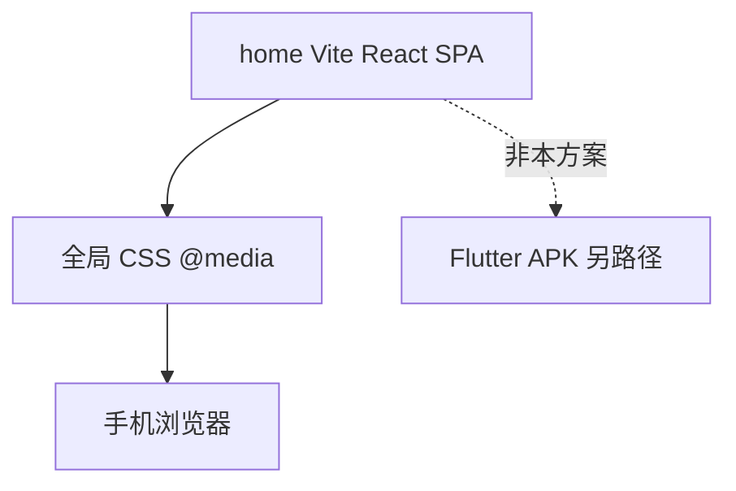

# 官网前端手机适配 · 技术选型与方案

> **目标**：`home/` 营销官网在手机浏览器可正常浏览，响应式不断裂。  
> **不是**：把官网做成 App，也不是 CapShip Flutter APK 交付。  
> **日期**：2026-07-30

---

## 1. 一句话原则

官网手机版 = **同一套 Vite + React SPA**，用 **手写 CSS + `@media`** 在窄屏下可读可点；员工端「手机 App」走 Flutter，见 [mobile-app-tech-selection.html](./previews/mobile-app-tech-selection.html)。



| 交付物 | 路径 | 本文是否覆盖 |
|--------|------|----------------|
| 营销官网 H5 | [`home/`](../home/) | ✅ |
| 管理端 Admin | [`frontend/`](../frontend/) | ❌ |
| 员工端 Web Runtime | [`runtime-web/`](../runtime-web/) | ❌ |
| 员工端 APK | [`runtime-app/`](../runtime-app/) + Flutter | ❌ · 见 [FLUTTER-MODULAR-APK.md](./FLUTTER-MODULAR-APK.md) |

---

## 2. 技术选型（拍板）

| 项 | 选型 | 理由 |
|----|------|------|
| 框架 | 保持 **Vite + React 18** SPA | 现有 [`home/`](../home/) 架构，无需重建 |
| 样式 | **手写全局 CSS + CSS 变量 + `@media`** | 已有大量媒体查询；不引入 Tailwind（全量迁移成本高） |
| 布局单位 | `clamp()` / `%` / `min()` / `vw` + `env(safe-area-inset-*)` | 仓库已有部分用法，统一推广 |
| 标准断点 | **1200 / 960 / 768 / 480**（四档） | 收敛现有 1200/1024/960/900/860/800/768/640/480 混乱 |
| 导航（≤768） | **汉堡菜单 + 抽屉/全屏层** | 替换横向滚动 pill；见缺口分析 |
| 触控 | 可点区域 ≥ **44×44px**；关键操作不依赖 hover | 手机可点 |
| 视口 | 保留现有 meta | [`home/index.html`](../home/index.html)：`width=device-width, initial-scale=1.0, viewport-fit=cover` |
| 动效 | 尊重 `prefers-reduced-motion`；窄屏可跳过重型 Intro | 已有 [`HomePageIntro.tsx`](../home/src/components/b2b/HomePageIntro.tsx) ≤768 跳过 |

### 明确不采用

| 方案 | 原因 |
|------|------|
| Tailwind / Bootstrap 全量迁入 | 与现有全局 class 体系冲突，ROI 低 |
| 单独「手机站」子域 / 第二套页面 | 双份文案与路由，维护爆炸 |
| WebView 套官网冒充 App | 与 CapShip 双端契约无关，禁止冒充正式手机交付 |
| React Native / 仅靠压窄 Admin | 超出官网范围 |

---

## 3. 现状评估

### 3.1 已具备

| 能力 | 位置 |
|------|------|
| Viewport + safe-area 意识 | [`home/index.html`](../home/index.html)；header / plaza 等处有 `safe-area-inset` |
| 首页 / B2B 大量 ≤768 规则 | [`home/src/styles/b2b-landing.css`](../home/src/styles/b2b-landing.css) |
| 广场侧栏折叠 + 底栏 Tab | [`home/src/index.css`](../home/src/index.css)（约 ≤900：`plaza-mobile-tabs`）；[`PlazaLayout.tsx`](../home/src/pages/plaza/PlazaLayout.tsx) |
| 主题与 plaza 覆盖 | [`plaza-theme.css`](../home/src/styles/plaza-theme.css)、[`marketing-landed.css`](../home/src/styles/marketing-landed.css) |
| 设计 token | [`shared/design-tokens.css`](../shared/design-tokens.css)（由 `index.css` 引入） |

### 3.2 主要缺口

| 缺口 | 说明 |
|------|------|
| **Header IA** | [`B2BHeader.tsx`](../home/src/components/b2b/B2BHeader.tsx) 在 ≤768 仍渲染完整 [`B2B_NAV_ITEMS`](../home/src/data/homeNav.ts)；CSS 仅让 [`.b2b-nav-rail`](../home/src/styles/b2b-landing.css) **横向滚动**，无汉堡抽屉 |
| **断点不统一** | 同仓混用 1024 / 900 / 860 / 800 / 640 等，后续规则难对齐 |
| **Hero CTA 密度** | 窄屏三按钮并排时字号与触控区偏紧 |
| **浮动预约 Agent** | 大面板在小屏需强制全宽 / 底栏化，避免挡内容与横向溢出 |
| **静态行业页** | [`home/public/industry-sites/*`](../home/public/industry-sites) 另有一套 ~860px CSS，与 SPA 断点未对齐 |

### 3.3 正面范例（改造时对齐）

广场在窄屏隐藏双轨侧栏、改用 `plaza-mobile-tabs`：**用交互模式切换，而不是横向硬塞桌面布局**。Header 应采用同类思路（抽屉），而不是继续横滑 pill。

---

## 4. 断点与壳规范

### 4.1 标准四档（新代码只准用这些）

| 断点 | 含义 | 典型设备 |
|------|------|----------|
| `max-width: 480px` | 小手机 | SE / 窄屏安卓 |
| `max-width: 768px` | 手机（主档） | iPhone 标准宽 |
| `max-width: 960px` | 平板 / 小桌面 | iPad 竖屏、双栏改单栏 |
| `max-width: 1200px` | 大桌面以下收紧 | Hero 多列 → 少列 |

历史遗留的 `900` / `860` / `800` / `640`：**只读维护，新规则迁到上表最近档**（例如 860→960，640→768 或 480）。

建议在主样式表顶部用注释锚定（后续改代码时落地）：

```css
/* Breakpoints (home mobile SSOT):
   --bp-sm: 480px; --bp-md: 768px; --bp-lg: 960px; --bp-xl: 1200px;
*/
```

### 4.2 Header（P0）

| 宽度 | 行为 |
|------|------|
| > 768 | 现状：logo + nav pills + actions |
| ≤ 768 | logo + 主 CTA（可选 1 个）+ **汉堡**；点击打开抽屉/全屏层，内含全部 `B2B_NAV_ITEMS`、广场入口、登录/语言切换；打开时 `body` 锁滚 |

实现要点：React 本地 `menuOpen` 状态写在 [`B2BHeader.tsx`](../home/src/components/b2b/B2BHeader.tsx)；样式落在 [`b2b-landing.css`](../home/src/styles/b2b-landing.css)。

### 4.3 内容区

- 单列优先；卡片栅格在 960 / 768 降为 2→1 列
- 禁止整页出现横向滚动条（装饰层用 `overflow-x: hidden` 裁切，内容区本身不超宽）
- 图片 / 视频：`max-width: 100%`；固定 `px` 宽仅允许装饰性元素

### 4.4 浮动层 / Footer

- 浮动 Agent、Dock：≤768 宽度 `calc(100vw - 24px)` 或贴底全宽；预留底部 `safe-area`
- Footer：多列 → 单列堆叠（已有部分规则，按四档收口）

---

## 5. 页面优先级

| 优先级 | 表面 | 入口 / 样式 | 改造重点 |
|--------|------|-------------|----------|
| **P0** | 首页 Hero + 顶栏 | [`HomeApp.tsx`](../home/src/HomeApp.tsx)、[`B2BHeader.tsx`](../home/src/components/b2b/B2BHeader.tsx)、[`b2b-landing.css`](../home/src/styles/b2b-landing.css) | 汉堡抽屉、CTA、统计区无横滑 |
| **P1** | 广场 Feed / 我的应用 | [`PlazaLayout.tsx`](../home/src/pages/plaza/PlazaLayout.tsx)、[`index.css`](../home/src/index.css)、[`plaza-theme.css`](../home/src/styles/plaza-theme.css) | 巩固 mobile tabs；列表与发布弹层可点 |
| **P2** | Enrichment（信任/案例/定价/新闻/角色） | [`MarketingSiteShell.tsx`](../home/src/components/b2b/enrichment/MarketingSiteShell.tsx)、[`marketing-landed.css`](../home/src/styles/marketing-landed.css) | 栅格统一到 960/768 |
| **P2** | 行业详情 / CapShip OSS | Industry 页、[`capship-oss.css`](../home/src/styles/capship-oss.css) | 单列、表格可横滑容器内滚动 |
| **P3** | 静态行业 HTML | [`home/public/industry-sites/`](../home/public/industry-sites) | 断点对齐 768/960；非阻塞 |
| **—** | `/login` `/register` | 重定向 Admin | 不在本方案做手机登录页 |

---

## 6. 改造原则

1. **优先改 CSS，少改 DOM**；确需汉堡按钮时再动 Header JSX。
2. **沿用** `--b2b-*` / design-tokens，不新开一套「mobile-only」色板。
3. **禁止**为手机 fork 第二套路由或复制整页组件。
4. **同一断点语义**：新 `@media` 只使用 §4.1 四档。
5. **触控优先**：主按钮、导航项、关闭抽屉 ≥44px；不要用仅 hover 才出现的关闭控件。
6. **i18n**：导航文案继续走现有 `home.nav.*` key，抽屉内不写死中文。
7. **性能**：窄屏避免额外大图请求；已有 Intro 跳过逻辑保持。

---

## 7. 后续改代码顺序（文档建议 · 未在本文执行）

1. 在 [`b2b-landing.css`](../home/src/styles/b2b-landing.css) / [`index.css`](../home/src/index.css) 顶部标注四档断点 SSOT  
2. [`B2BHeader.tsx`](../home/src/components/b2b/B2BHeader.tsx)：汉堡 + 抽屉；≤768 隐藏横滑 rail  
3. Hero CTA / 统计区：收紧为可点单列或 2 列  
4. 浮动预约 Agent：≤768 全宽底栏化  
5. Plaza / enrichment / CapShip：按 P1→P2 扫无横向整页溢出  
6. 验收：Chrome DevTools + 真机 375 / 390 / 414  

---

## 8. 验收清单

在 **375 / 390 / 414** CSS 像素宽度下（竖屏）：

| # | 检查项 | 期望 |
|---|--------|------|
| 1 | 整页 | 无横向整页滚动 |
| 2 | Header | 汉堡可开合；抽屉内全部导航可点；打开时背景不滚 |
| 3 | Hero | 主标题可读；主 CTA 可点（≥44px） |
| 4 | 锚点区 | 产品 / 预约演示等区块不裁切关键按钮 |
| 5 | 广场 | 底栏 Tab 切换正常；列表可滚；发布相关控件可点 |
| 6 | Enrichment | 卡片单列；表格若超宽则在容器内横滑，不撑破页面 |
| 7 | 安全区 | 刘海 / Home 条不遮挡底栏与主按钮 |
| 8 | 横屏抽测 | 不强制完美，但不白屏、不锁死 |

---

## 9. 与 Flutter / CapShip 边界

| 问题 | 答案 |
|------|------|
| 官网手机适配是否等于「生成手机 App」？ | **否**。官网是营销与选型面。 |
| 员工用的手机 App 怎么出？ | Publish → Flutter APK；见 [mobile-app-tech-selection.html](./previews/mobile-app-tech-selection.html)、[FLUTTER-MODULAR-APK.md](./FLUTTER-MODULAR-APK.md)、[FLUTTER-APP-RUNTIME.md](./FLUTTER-APP-RUNTIME.md) |
| 手机浏览器打开 `/r/{appId}` 算什么？ | **Runtime H5**（`runtime-web`），不是本 `home/` 适配范围 |
| CapShip 契约 SSOT | [opensource/capship.html](./opensource/capship.html) |

冲突时：

- **营销站布局** → 以本文为准  
- **双端能力 / APK** → 以 CapShip / Flutter 文档为准  

---

## 10. 关键文件索引

| 文件 | 角色 |
|------|------|
| [`home/index.html`](../home/index.html) | viewport |
| [`home/src/main.tsx`](../home/src/main.tsx) | 入口；引入 `index.css` |
| [`home/src/App.tsx`](../home/src/App.tsx) | 路由 |
| [`home/src/HomeApp.tsx`](../home/src/HomeApp.tsx) | 首页组装 |
| [`home/src/components/b2b/B2BHeader.tsx`](../home/src/components/b2b/B2BHeader.tsx) | 顶栏（P0 改造点） |
| [`home/src/data/homeNav.ts`](../home/src/data/homeNav.ts) | 导航项 |
| [`home/src/styles/b2b-landing.css`](../home/src/styles/b2b-landing.css) | B2B / 首页主样式 |
| [`home/src/index.css`](../home/src/index.css) | 共享 + 广场等 |
| [`home/src/pages/plaza/PlazaLayout.tsx`](../home/src/pages/plaza/PlazaLayout.tsx) | 广场壳 |
| [`docs/previews/mobile-app-tech-selection.html`](./previews/mobile-app-tech-selection.html) | 手机 **App** 选型（非本文） |

---

## 11. 修订记录

| 日期 | 说明 |
|------|------|
| 2026-07-30 | 初版：选型拍板、现状、四档断点、优先级、验收与 Flutter 边界 |
| 2026-07-30 | 已落地 P0–P2：Header 汉堡抽屉、Hero CTA 竖排、预约浮层贴底全宽、断点注释、Plaza/enrichment/CapShip 防横溢 |
