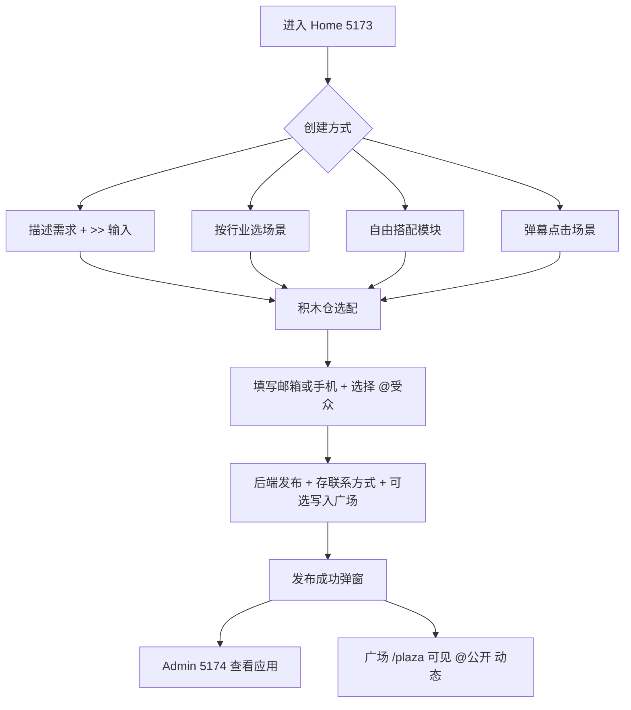

# 积木仓 BlockHub · 功能清单与项目排期

> 版本 v0.3 · 2026-07 · Home `:5173` + Admin `:5174` + API `:8001`

---

## 一、产品定位

**积木仓 BlockHub** 是企业智能体应用的零代码创建平台。用户通过描述需求、选行业或自由搭配模块，组合出可发布的 Web/App 应用；Admin 端作为员工工作台演示已发布能力。

---

## 二、当前已交付功能（v0.3）

### A. 品牌与全站体验

| 编号 | 功能 | 状态 | 说明 |
|------|------|------|------|
| A1 | 统一品牌 | ✅ | 积木仓 / BlockHub，5173 与 5174 共用 Logo 与文案 |
| A2 | 共享主题引擎 | ✅ | `shared/themes.ts`，localStorage `blockhub-theme` |
| A3 | 四套配色 | ✅ | **黑白商务（默认）**、樱花暮色、墨绿琥珀、深海珊瑚 |
| A4 | 全站配色同步 | ✅ | Admin 顶栏切换，Home 刷新后一致 |
| A5 | 一键启动 | ✅ | `start-all.ps1` 启动三端 |

### B. Home 创建入口（5173）

| 编号 | 功能 | 状态 | 说明 |
|------|------|------|------|
| B1 | 英雄区魔方带 | ✅ | 5 大能力 3×3 魔方面滚动 |
| B2 | 中心流动 `>>` | ✅ | 魔方带中央 `>>` 符号流动动画 +「定义智能体符号」 |
| B3 | 身份×场景弹幕 | ✅ | 30 条预设，10 轨道，点击打开 `>>` 对话框 |
| B4 | 弹幕一键生成 | ✅ | 对话框「生成应用」→ 填联系方式 → 发布 |
| B5 | 三合一创建 | ✅ | 描述需求 / 按行业 / 自由搭配 |
| B6 | Agent 符号输入 | ✅ | `>>` 前缀、模块芯片、命令面板 |
| B7 | 提示词优化 | ✅ | 简单描述 → 模块推荐 + 增强预览 |
| B8 | 积木仓选配 | ✅ | 浮动仓、顺序组合、系统补齐 |
| B9 | 114 场景目录 | ✅ | 办公/行业筛选、矩形卡片、能力文案可读化 |
| B10 | 底部能力总览 | ✅ | 10/114/5 全量展示 |
| B11 | 联系方式门禁 | ✅ | 生成前填写邮箱（尾缀联想）或手机号 |
| B12 | 发布弹窗 | ✅ | Web URL + App 预览链 + 跳转 Admin |
| B13 | 我的应用 | ✅ | localStorage 记录 + 顶栏入口 |
| B14 | 广场 · Newsfeed | 🔶 | 方案 B 已定稿 · `/plaza` Mock 壳 · W4 接 API |

### C. Admin 管理后台（5174）

| 编号 | 功能 | 状态 | 说明 |
|------|------|------|------|
| C1 | 工作台总览 | ✅ | 仪表盘、趋势、已创建应用 |
| C2 | 能力中心 | ✅ | 10 大能力浏览 |
| C3 | 场景目录 | ✅ | 114 场景只读 |
| C4 | 创建向导 | ✅ | 分步创建 |
| C5 | 员工能力页 | ✅ | 问答 / 知识库 / 审批 / 报表 / 通知 |
| C6 | 全站配色 | ✅ | 顶栏四主题切换 |
| C7 | 跳转 Home | ✅ | 顶栏返回创建入口 |

### D. 后端（8001）

| 编号 | 功能 | 状态 | 说明 |
|------|------|------|------|
| D1 | Catalog API | ✅ | 办公/行业场景、汇总 |
| D2 | 统一发布 | ✅ | `/creation/publish`，含 contact 字段 |
| D3 | 应用列表 | ✅ | 内存存储，含联系方式 |
| D4 | Dashboard | ✅ | 演示数据 |

---

## 三、待建设功能（按优先级）

### P0 · 商用底座（第 1–3 周）

| # | 功能 | 交付标准 |
|---|------|----------|
| P0-1 | PostgreSQL 持久化 | 用户、应用、发布记录、联系方式落库 |
| P0-2 | JWT 统一登录 | Home + Admin 共用账号 |
| P0-3 | 联系方式通知 | 发布成功后邮件/短信真实发送 |
| P0-4 | Logo 资产补齐 | `home/public` 全尺寸 PNG |
| P0-5 | 场景 ID 精准映射 | 弹幕预设 ↔ Catalog 114 场景 |
| P0-6 | 发布状态机 | pending / success / failed + 重试 |
| P0-7 | OpenAPI 契约冻结 | Swagger 为唯一接口源 |

### P1 · 端到端闭环（第 4–6 周）

| # | 功能 | 交付标准 |
|---|------|----------|
| P1-0 | @ 受众 + 广场 | 发布选 @公开/部门/角色 · `GET /plaza/feed` · 点赞/评论/转发 PG |
| P1-1 | Runtime 预览 | `/runtime/{appId}` 按 Schema 渲染 |
| P1-2 | 三入口统一选配 | Industry / Module / Prompt 共用积木仓 |
| P1-3 | 20 行业映射 | 展示行业 ↔ 5 深度包 API |
| P1-4 | Admin 应用管理 | 编辑、下架、跳转 runtime、查看联系方式 |
| P1-5 | deliver 双端产物 | web / app / both 影响发布结果 |
| P1-6 | 弹幕运营后台 | 30+ 预设可配置，无需改代码 |

### P2 · 智能化与多端（第 7–10 周）

| # | 功能 | 交付标准 |
|---|------|----------|
| P2-1 | LLM 场景理解 | 自然语言 → 模块 + 提示词 |
| P2-2 | Catalog CRUD | 114 场景可运营 |
| P2-3 | 员工端 App | Flutter / WebView 可安装演示 |
| P2-4 | 能力页实数据 | 审批/消息/报表接真实流 |
| P2-5 | 多租户 | 企业空间、角色分权 |
| P2-6 | 启动健康检查 | `start-all.ps1` 就绪探测 |

### P3 · 增长与生态（第 11–14 周）

| # | 功能 | 说明 |
|---|------|------|
| P3-1 | 行业模板市场 | 一键导入场景包 |
| P3-2 | 插件 SDK | 第三方模块接入 |
| P3-3 | 经营看板 | 老板视角分析 |
| P3-4 | 国际化 | 中英文 |
| P3-5 | 私有化部署 | Docker Compose 一键交付 |

---

## 四、里程碑排期

```text
Week 1   ████████░░  v0.3 交付：品牌统一、黑白默认、>>流动、联系门禁、场景文案修复
Week 2   ██████░░░░  PG 模型 + JWT + 发布/联系落库
Week 3   ████████░░  状态机 + API 契约 + @受众 UI + /plaza 壳
Week 4   ██████░░░░  广场 Feed API + Runtime 最小预览 + Admin 应用管理
Week 5   ████████░░  三入口统一 + deliver 双端
Week 6   ██████████  端到端验收：创建→联系→发布→员工使用
Week 7-8 ██████░░░░  LLM + Catalog 运营 + 弹幕配置
Week 9-10 ████████░░ 移动端 + 审批/消息实数据
Week 11-14 ██████░░░░ 多租户 + 模板市场 + 私有化
```

---

## 五、核心用户流程



---

## 六、技术架构

```text
shared/
  brand.ts      — 品牌常量
  themes.ts     — 四套主题 + applyTheme()

home/  :5173    — 创建入口（英雄区、弹幕、三视图、联系门禁）+ /plaza 广场
frontend/ :5174 — Admin 工作台（配色切换、应用列表）
backend/ :8001  — FastAPI（Catalog、Creation、Dashboard）
```

---

## 七、本版变更摘要（v0.3）

1. 英雄区 `>>` 移至魔方带中央，横向流动动画
2. 场景卡片底部装饰条不再遮挡「适用」文案；agent 显示中文能力名
3. 默认主题改为 **黑白商务**
4. 生成应用前增加 **联系方式门禁**（邮箱尾缀联想 / 手机号）
5. 发布 API 增加 `contact_email` / `contact_phone` 字段

---

## 八、本地验证

```powershell
.\start-all.ps1
```

1. Home 默认灰白商务风；Admin 切换「全站配色」可切樱花暮色等
2. 英雄区魔方中间可见流动 `>>`
3. 场景卡片「适用：审批流 · 知识库 · 数据报表」完整显示
4. 选模块 → 生成 → 弹出联系方式 → 确认后发布
5. Admin 总览可见新创建应用

---

## 九、待拍板

1. 联系方式是否必填？（当前：必填才能生成）
2. Phase 2 验收：仅落库，还是必须 Runtime 可点？
3. Admin 是否叠加平台运营后台？
4. 移动端：Flutter 真机 vs H5 套壳优先？
